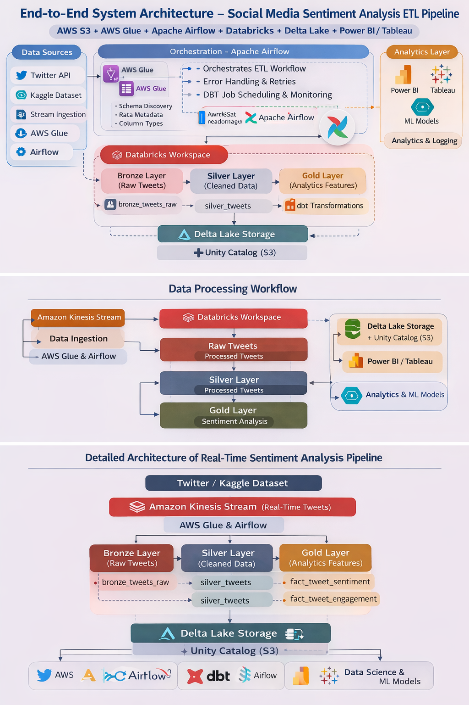

# Real-Time Social Media Analytics Pipeline (Databricks + PySpark)

---

## Project Overview

This project implements a scalable end-to-end data pipeline for social media analytics using:

AWS • Databricks • PySpark • Delta Lake • Apache Airflow

The pipeline is designed using the Medallion Architecture (Bronze → Silver → Gold) to transform raw data into analytics-ready datasets.

It supports both:

* Batch processing (S3 + Glue)
* Near real-time streaming (Amazon Kinesis)

The goal is to generate actionable insights from social media data, enabling sentiment tracking, trend analysis, and user behavior understanding.

---

## Key Business Outputs

* Sentiment trend analysis (Positive / Negative / Neutral)
* User influence rankings based on engagement score
* Topic performance insights (AI, Sports, Finance, Cloud)
* Geographic trend analysis by country
* Valid vs invalid tweet distribution
* Daily & hourly tweet activity patterns

---

## Dataset

### Source

* AWS S3 Bucket — realtime-parquetfiles (eu-north-1)
* Registered via AWS Glue Catalog → realtime_tweets

### Tables Used

* tweets_tb → Raw tweet content
* sentiment_tb → Sentiment scores
* trends_tb → Trending topics
* user_metadata_tb → User data
* valid_tb → Validated tweets

Each dataset contains approximately 50,500 records.

---

## Architecture

The pipeline integrates:

* AWS S3 (Storage)
* AWS Glue (Metadata)
* Amazon Kinesis (Streaming)
* Databricks (Processing)
* Delta Lake (Storage Layer)
* Apache Airflow (Orchestration)

### Architecture Diagram



---

## Medallion Architecture Layers

### Bronze Layer (Raw Data)

* Ingests raw data from S3/Kinesis
* Maintains original data without transformation
* Adds ingestion timestamp
* Ensures data lineage and traceability

---

### Silver Layer (Cleaned Data)

* Data cleaning and standardization
* Handles missing values
* Removes duplicates
* Applies schema validation
* Enriches data (topic, country)

Output size: ~47K records per dataset

---

### Gold Layer (Analytics Data)

* Business-ready datasets
* Fact and dimension tables
* Aggregated metrics and KPIs

### Star Schema (Gold Layer)


---

## Pipeline Orchestration

Managed using Apache Airflow DAGs

### Tasks

* Bronze ingestion
* Silver transformation
* Gold aggregation

Runs daily at midnight with monitoring and retry mechanisms.

### Airflow DAG


---

## Data Quality Checks

* Schema validation
* Null handling using averages
* Duplicate removal
* File existence checks (S3)
* Row count validation

Monitoring via:

* Airflow logs
* Databricks logs
* AWS S3 logs

---

## Project Structure

```
Real-Time-Social-Media-Sentiment-Analysis-Pipeline
│
├── Datasets
│   └── raw_data
│
├── Development
│   ├── Bronze
│   │   └── bronze_code.py
│   ├── Silver
│   │   └── silver_code.py
│   ├── Gold
│   │   └── gold_code.py
│   └── DAG
│       └── dag_code.py
│
├── Testing
│   ├── test_bronze.py
│   ├── test_silver.py
│   └── test_gold.py
│
├── Dashboard
│   ├── images
│   │   ├── final-arch.png
│   │   ├── airflow.jpeg
│   │   ├── star_schema_gold_layer.svg
│   │   ├── tweet_dashboard.png
│   │   ├── sentiment_dashboard.png
│   │   ├── trend_dashboard.png
│   │   ├── users_influence_dashboard.png
│   │   └── overview_dashboard.png
│   └── dashboard_queries.ipynb
│
└── README.md
```

---

## Analytics Dashboards

These dashboards provide insights into sentiment trends, user behavior, and topic performance.

### Overview Dashboard


---

### Tweet Activity Dashboard


---

### Sentiment Analysis Dashboard


---

### Trend Analysis Dashboard


---

### User Influence Dashboard


---

## Business Insights

* Sentiment Analysis → Track sentiment trends per topic
* User Influence → Identify top influencers
* Topic Performance → Measure engagement per topic
* Geographic Trends → Country-level insights
* Data Quality Monitoring → Valid vs invalid tweets
* Peak Activity Analysis → Identify active hours

---

## Technologies Used

* Python
* PySpark
* Databricks
* Delta Lake
* AWS S3
* AWS Glue
* Amazon Kinesis
* Apache Airflow
* Unity Catalog
* Databricks SQL
* Git and GitHub

---

## Installation

```bash
git clone https://github.com/Sahanap1708/real-time-sentiment-pipeline.git
cd real-time-sentiment-pipeline
pip install -r requirements.txt
```

---

## Running the Pipeline

### Databricks

* Upload notebooks
* Create jobs (Bronze → Silver → Gold)
* Use cluster: realtime-cluster
* Schedule execution

### Airflow

```bash
airflow dags trigger socialmedia_pipeline_dag
```

---

## Future Enhancements

* Full real-time streaming (Kafka/Kinesis)
* Machine learning sentiment models
* Advanced dashboards (Power BI / Tableau)
* Automated alerting system
* Multi-platform integration

---

## License

This project is for educational and research purposes.

---

## Author

Sahana P (Team Lead)

### Team Members

* Sahana P
* Gullanki Vara Naga Sai Sree
* Subhadip Sasmal
* Peruri Sireesha

---

## Original Team Repository

https://github.com/perurisiri/Real-Time-Social-Media-Sentiment-Analysis-Pipeline
