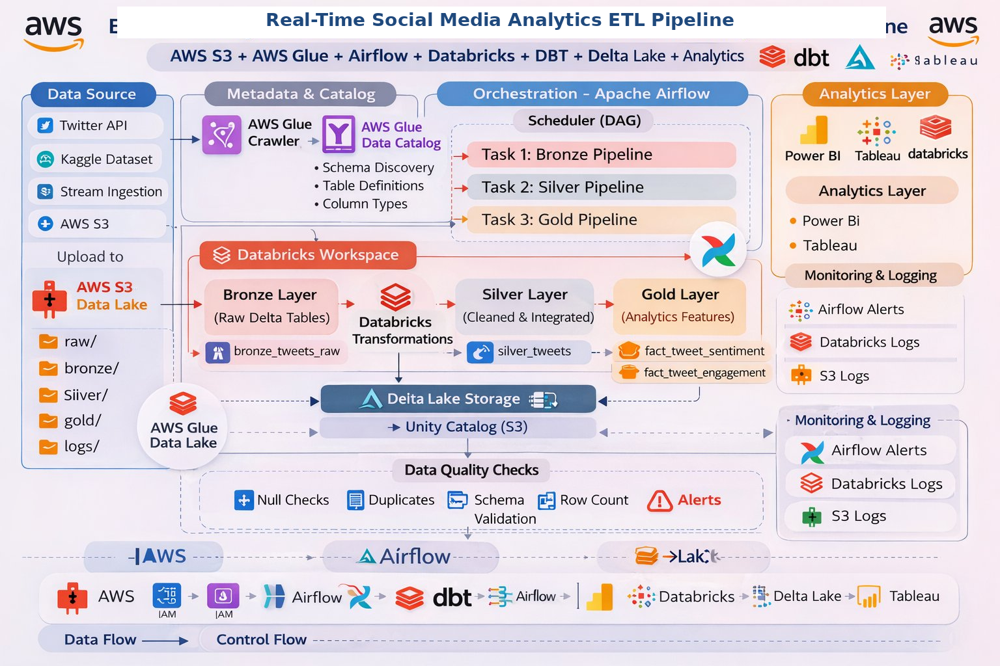

# Real-Time Social Media Analytics Pipeline (Databricks + PySpark)

---

## Project Overview

This project implements an **end-to-end data pipeline** for social media analytics using:

**AWS • Databricks • PySpark • Delta Lake • Apache Airflow**

The pipeline follows the **Medallion Architecture (Bronze → Silver → Gold)** to transform raw data into **analytics-ready datasets**.

It also supports **real-time streaming ingestion using Amazon Kinesis**, enabling near real-time sentiment analysis.

---

## Key Business Outputs

* Sentiment trend analysis (Positive / Negative / Neutral)
* User influence rankings based on engagement score
* Topic performance insights (AI, Sports, Finance, Cloud)
* Geographic trend analysis by country
* Valid vs invalid tweet distribution
* Daily & hourly tweet activity patterns

---

## Dataset

### Source

* AWS S3 Bucket — `realtime-parquetfiles (eu-north-1)`
* Registered via AWS Glue Catalog → `realtime_tweets`

### Tables Used

* `tweets_tb` → Raw tweet content  
* `sentiment_tb` → Sentiment scores  
* `trends_tb` → Trending topics  
* `user_metadata_tb` → User data  
* `valid_tb` → Validated tweets  

Each dataset contains ~50,500 records

---

## Architecture

The pipeline integrates:

* AWS (S3, Glue, Kinesis)
* Databricks (Processing)
* Delta Lake
* Airflow (Orchestration)

---

## Medallion Architecture Layers

### Bronze Layer (Raw Data)

* Stores raw data from S3/Kinesis  
* Maintains data lineage  
* Adds ingestion timestamp  
* Minimal transformation  

---

### Silver Layer (Cleaned Data)

* Data cleaning & standardization  
* Null handling & duplicate removal  
* Schema enforcement  
* Data enrichment  

---

### Gold Layer (Analytics Data)

* Business-ready datasets  
* Fact & dimension tables  
* Aggregations & KPIs  

---

## Pipeline Orchestration

* Managed using Apache Airflow DAGs  
* Automates Bronze → Silver → Gold pipeline  
* Runs daily with monitoring & retries  

---

## Data Quality Checks

* Schema validation  
* Null handling  
* Duplicate removal  
* File existence checks  
* Row count validation  

---

## Project Structure

---

## Analytics Dashboards

* Overview Dashboard  
* Tweet Activity Dashboard  
* Sentiment Dashboard  
* Trend Dashboard  
* User Influence Dashboard  

---

## Technologies Used

* Python  
* PySpark  
* Databricks  
* Delta Lake  
* AWS S3  
* AWS Glue  
* Amazon Kinesis  
* Apache Airflow  
* Unity Catalog  
* Git & GitHub  

---

## Future Enhancements

* Full real-time streaming (Kafka/Kinesis)  
* Machine learning sentiment models  
* Advanced dashboards (Power BI / Tableau)  
* Automated alerting system  

---

## Author

**Sahana P (Team Lead)**  

### Team Members
* Sahana P  
* Gullanki Vara Naga Sai Sree  
* Subhadip Sasmal  
* Peruri Sireesha  

---

## Note

This is a **team project**.  
Original repository:  
https://github.com/perurisiri/Real-Time-Social-Media-Sentiment-Analysis-Pipeline